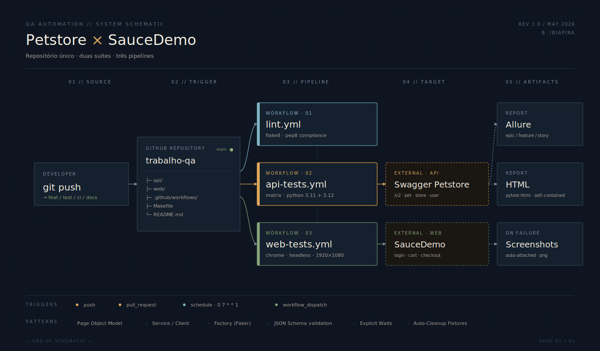

# Trabalho de Automacao de Testes - QA

[](https://github.com/brunoibiapina/trabalho-qa-automacao/actions/workflows/api-tests.yml)
[](https://github.com/brunoibiapina/trabalho-qa-automacao/actions/workflows/web-tests.yml)
[](https://github.com/brunoibiapina/trabalho-qa-automacao/actions/workflows/lint.yml)
[](https://www.python.org/)
[](LICENSE)

Repositorio unico contendo dois projetos de automacao de testes:

1. **[API - Swagger Petstore](./api)** - cobertura dos endpoints Pet, Store e User
2. **[Web - SauceDemo](./web)** - fluxo E2E de login, carrinho e checkout com Selenium

Ambos os projetos rodam em pipelines independentes no GitHub Actions.

## Visao geral



> Para uma visao executiva com KPIs do projeto, abra o **[Dashboard](./docs/dashboard.html)** no navegador.

## Demonstracao

<!-- COLE_GIF_AQUI -->

<!-- /COLE_GIF_AQUI -->

> Fluxo `test_full_checkout` rodando no Chrome: login → adicao de produtos → checkout → confirmacao.

<details>
<summary>Como gerar este GIF (instrucoes para Bruno)</summary>

```bash
# 1. Roda o teste no modo VISUAL (com janela), com slow-mo pro GIF ficar legivel
cd web
HEADLESS=false pytest tests/test_checkout.py::TestCheckout::test_full_checkout -v

# 2. Em outro terminal/app, grava a tela enquanto o teste roda:
#    macOS:    Kap (https://getkap.co) ou Cmd+Shift+5 (QuickTime)
#    Windows:  ScreenToGif (https://www.screentogif.com)
#    Linux:    Peek (https://github.com/phw/peek)

# 3. Recorta apenas a janela do navegador (evita gravar o desktop inteiro)

# 4. Salva como GIF com no maximo:
#    - 800x500 px
#    - 15 fps
#    - 2-3 MB

# 5. Coloca o arquivo em docs/checkout_demo.gif e da push
mv ~/Desktop/checkout_demo.gif docs/checkout_demo.gif
git add docs/checkout_demo.gif
git commit -m "docs: adicionar gif de demonstracao do checkout E2E"
git push
```

</details>

## Stack

| Camada | Tecnologia |
|--------|-----------|
| Linguagem | Python 3.11+ |
| Framework de testes | pytest |
| API | requests + jsonschema + Faker |
| Web | Selenium 4 + webdriver-manager |
| Relatorios | Allure Report + pytest-html |
| CI/CD | GitHub Actions |
| Lint | flake8 |

## Estrutura

```
.
├── api/                    # Projeto de testes da API Petstore
├── web/                    # Projeto de testes web SauceDemo
├── .github/workflows/      # Pipelines CI
│   ├── api-tests.yml
│   ├── web-tests.yml
│   └── lint.yml
├── Makefile                # Comandos uteis
├── TEST_STRATEGY.md        # Estrategia de testes detalhada
├── LICENSE
└── README.md
```

## Pre-requisitos

- Python 3.11 ou superior
- Chrome ou Firefox instalado (para os testes web)
- (Opcional) Allure CLI para gerar relatorios visuais

```bash
# macOS
brew install allure

# Linux
sudo apt install -y allure
```

## Instalacao

```bash
git clone https://github.com/brunoibiapina/trabalho-qa-automacao.git
cd SEU_REPO
make install
```

Ou manualmente:

```bash
cd api && pip install -r requirements.txt && cd ..
cd web && pip install -r requirements.txt && cd ..
```

## Execucao rapida

```bash
make test          # Roda os dois projetos
make test-api      # Apenas API
make test-web      # Apenas Web
make smoke         # Apenas testes smoke nos dois
make allure-api    # Abre relatorio Allure da API
make allure-web    # Abre relatorio Allure do Web
```

Detalhes em cada projeto:
- [api/README.md](./api/README.md)
- [web/README.md](./web/README.md)

## CI/CD

Cada projeto tem seu workflow proprio rodando em paralelo:

| Workflow | Trigger | O que faz |
|----------|---------|-----------|
| `api-tests.yml` | push, PR, agendado, manual | Roda suite da API em matriz Python 3.11/3.12 |
| `web-tests.yml` | push, PR, agendado, manual | Roda suite Web no Chrome headless |
| `lint.yml` | push, PR | Valida estilo de codigo com flake8 |

Os relatorios HTML e Allure ficam disponiveis como **artifacts** do workflow. Em falhas dos testes web, o screenshot do momento do erro tambem e anexado.

## Relatorios

Apos rodar a suite localmente:

```bash
cd api          # ou cd web
allure serve allure-results
```

O relatorio abre no navegador com:

- Steps de cada teste
- Tempo de execucao
- Screenshots em falhas (web)
- Categorizacao por epic/feature/story
- Historico

## Documentacao

| Documento | Conteudo |
|-----------|----------|
| [TEST_STRATEGY.md](./TEST_STRATEGY.md) | Piramide de testes, criterios de selecao, abordagem de dados |
| [ARCHITECTURE.md](./ARCHITECTURE.md) | Arquitetura, padroes (Service/Client, POM), camadas, decisoes |
| [TEST_CASES.md](./TEST_CASES.md) | Catalogo formal dos 38 casos de teste com IDs e resultados esperados |
| [api/README.md](./api/README.md) | Detalhes do projeto de API |
| [web/README.md](./web/README.md) | Detalhes do projeto Web |

## Padroes adotados

- **API**: Service/Client pattern, schema validation, factories, fixtures de setup/teardown
- **Web**: Page Object Model, DriverFactory, esperas explicitas, screenshot em falhas
- **Geral**: markers para selecao de testes, separacao clara em camadas, sem hardcode (tudo via .env / factory)

## Autor

Bruno Ibiapina - Trabalho de QA / Automacao de Testes
